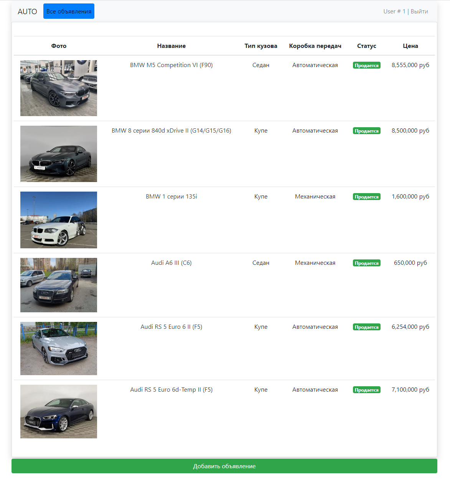
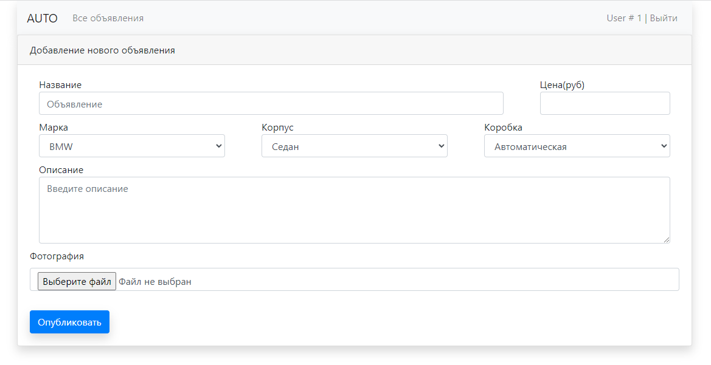
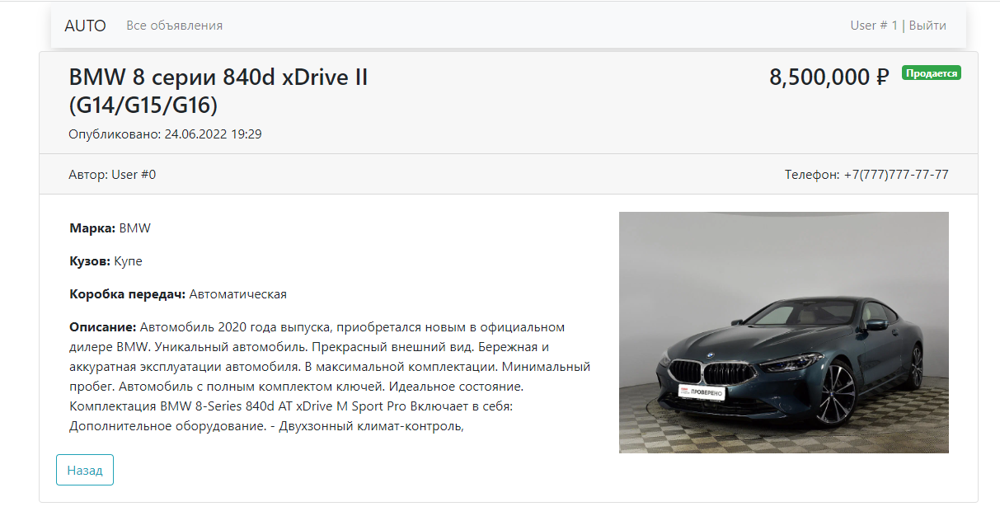
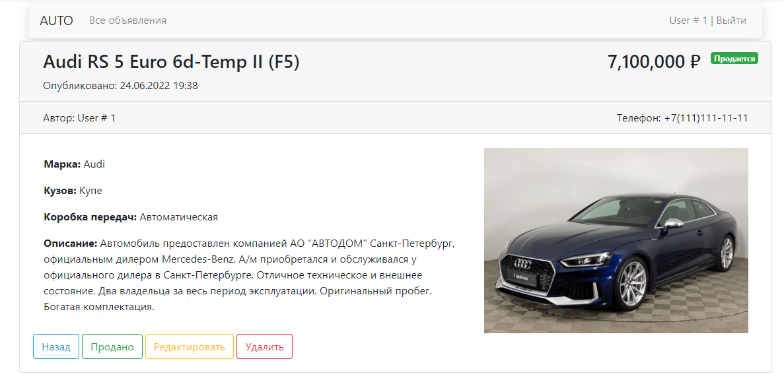
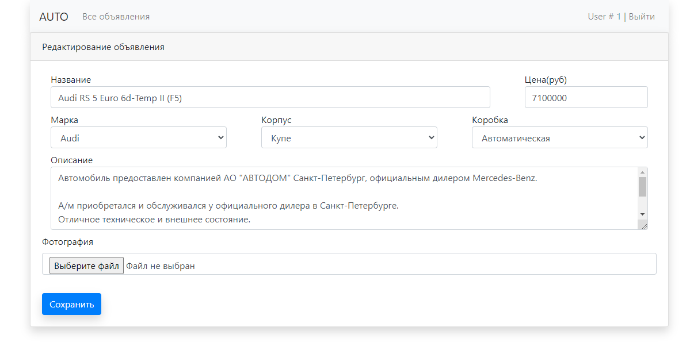
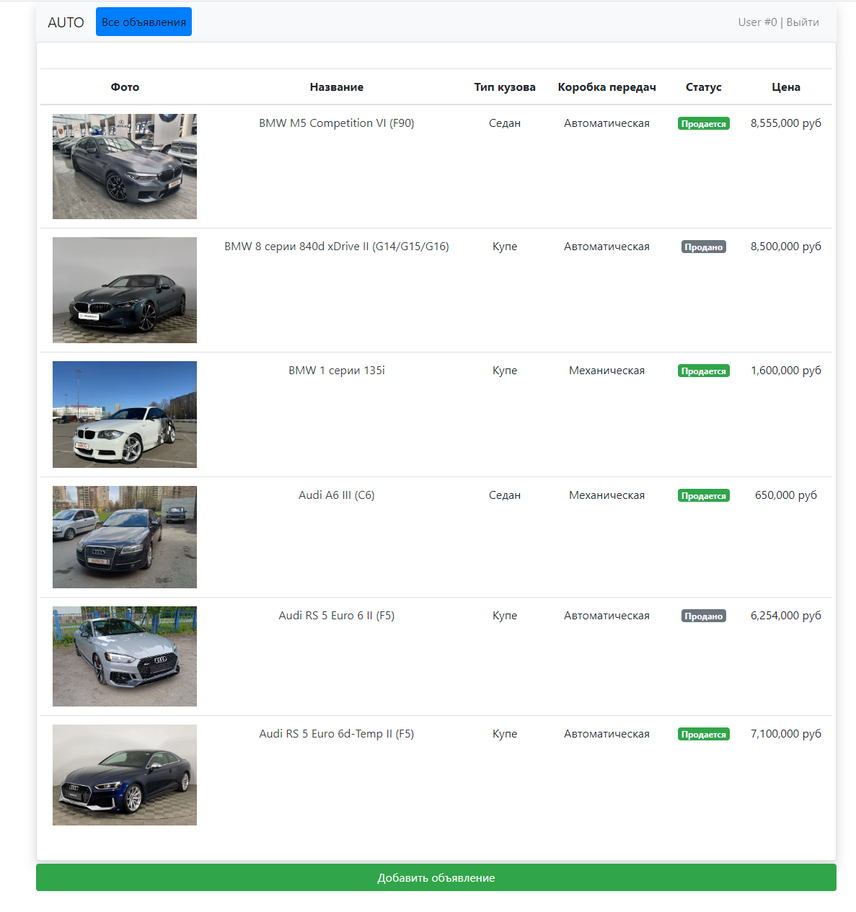

# Продажа машин

## О проекте.

#### Описание
Web-приложение для размещения объявлений о продаже автомобилей.

#### Технологии
> JDK17, Maven, PostgreSQL, Hibernate, HQL

## Использование

Главное окно приложения состоит из списка объявлений.

Есть возможность добавить новое объявление.

Кликнув по фото или названию объявления мы перейдем в подробное описание.

Если это объявление разместил пользователь, тогда нам доступно редактирование, удаление и изменение статуса.

## Контакты

